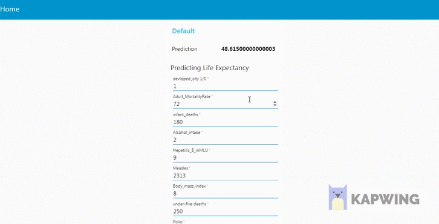

# llSPS-INT-1571-Predicting-Life-Expectancy-using-Machine-Learning
Predicting Life Expectancy using Machine Learning

https://noderedsumit.eu-gb.mybluemix.net/ui/#!/0?socketid=FakFcQC3FKosnyt8AABi

Problem Statnment -> This problem statement is aimed at predicting Life Expectancy rate of a country given various features.
Life expectancy is a statistical measure of the average time a human being is expected to live, Life expectancy depends on various factors: Regional variations, Economic Circumstances, Sex Differences, Mental Illnesses, Physical Illnesses, Education, Year of their birth and other demographic factors.
This problem statement provides a way to predict average life expectancy of people living in a country when various factors such as year, GDP, education, alcohol intake of people in the country, expenditure on healthcare system and some specific disease related deaths that happened in the country.

->The objective of the Project is to predict the Life Expectancy of a person ,
I Used machine learning model Random Forest as it gave maximum accuracy.

->I have Build a Node-RED Flow To Integrate ML Services

->Model is created on IBM Watson Studio service and Deployed on Node-Red Service.

